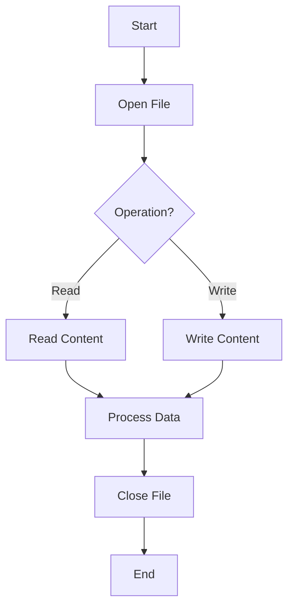

# File Handling and JSON in Python

## Table of Contents
1. [Introduction](#introduction)
2. [Learning Objectives](#learning-objectives)
3. [File Handling in Python](#file-handling-in-python)
   - [Opening a File](#opening-a-file)
   - [Writing to a File](#writing-to-a-file)
   - [Reading from a File](#reading-from-a-file)
   - [Moving the Cursor](#moving-the-cursor)
   - [Closing Files](#closing-files)
   - [The `with` Statement](#the-with-statement)
4. [JSON in Python](#json-in-python)
   - [Serialization](#serialization)
   - [Deserialization](#deserialization)
5. [Command Line Arguments](#command-line-arguments)
6. [Diagram: File Operations Workflow](#diagram-file-operations-workflow)
7. [Code Examples](#code-examples)
8. [Project Requirements](#project-requirements)
9. [Testing](#testing)

## Introduction

Python is an awesome programming language for many reasons, including its simplicity, readability, and extensive standard library. In this project, we'll focus on file handling and JSON operations in Python, which are crucial skills for any programmer.

## Learning Objectives

By the end of this project, you should be able to:

- Open, write to, and read from files in Python
- Use the `with` statement for file operations
- Understand and use JSON for data serialization and deserialization
- Access command line parameters in Python scripts

## File Handling in Python

### Opening a File

To open a file in Python, use the `open()` function:

```python
file = open('example.txt', 'r')  # 'r' for read mode
```

### Writing to a File

To write to a file, open it in write mode and use the `write()` method:

```python
with open('example.txt', 'w') as file:
    file.write('Hello, World!')
```

### Reading from a File

To read the entire content of a file:

```python
with open('example.txt', 'r') as file:
    content = file.read()
    print(content)
```

To read a file line by line:

```python
with open('example.txt', 'r') as file:
    for line in file:
        print(line.strip())
```

### Moving the Cursor

Use `seek()` to move the cursor within a file:

```python
with open('example.txt', 'r') as file:
    file.seek(5)  # Move to the 6th byte in the file
    print(file.read(10))  # Read 10 characters from that position
```

### Closing Files

Always close files after using them:

```python
file = open('example.txt', 'r')
# Do something with the file
file.close()
```

### The `with` Statement

The `with` statement automatically closes the file after you're done:

```python
with open('example.txt', 'r') as file:
    content = file.read()
# File is automatically closed here
```

## JSON in Python

JSON (JavaScript Object Notation) is a lightweight data interchange format.

### Serialization

Convert Python objects to JSON strings:

```python
import json

data = {"name": "John", "age": 30}
json_string = json.dumps(data)
```

### Deserialization

Convert JSON strings to Python objects:

```python
json_string = '{"name": "John", "age": 30}'
data = json.loads(json_string)
```

## Command Line Arguments

Access command line arguments using the `sys` module:

```python
import sys

if len(sys.argv) > 1:
    print(f"First argument: {sys.argv[1]}")
```

## Diagram: File Operations Workflow



## Code Examples

Here's a comprehensive example that demonstrates file handling, JSON operations, and command line arguments:

```python
#!/usr/bin/python3
import json
import sys

def write_to_file(filename, data):
    with open(filename, 'w') as file:
        json.dump(data, file)
    print(f"Data written to {filename}")

def read_from_file(filename):
    with open(filename, 'r') as file:
        data = json.load(file)
    return data

if __name__ == "__main__":
    if len(sys.argv) < 2:
        print("Usage: ./script.py <filename>")
        sys.exit(1)

    filename = sys.argv[1]
    
    # Writing to file
    data_to_write = {"name": "Alice", "age": 30, "city": "New York"}
    write_to_file(filename, data_to_write)
    
    # Reading from file
    read_data = read_from_file(filename)
    print("Data read from file:", read_data)
    
    # Modifying and writing back
    read_data["age"] = 31
    write_to_file(filename, read_data)
    
    # Reading again to confirm changes
    updated_data = read_from_file(filename)
    print("Updated data:", updated_data)
```

## Project Requirements

- Use Python 3.8.5 on Ubuntu 20.04 LTS
- Follow PEP 8 style guide (use pycodestyle 2.7.*)
- All files should be executable and end with a new line
- Start each file with `#!/usr/bin/python3`
- Include a `README.md` file in the root of the project folder

## Testing

- Create test files in a `tests` folder with `.txt` extension
- Run tests using: `python3 -m doctest ./tests/*`
- Ensure all modules, classes, and functions have proper documentation

Remember to work collaboratively on test cases to cover all edge cases!